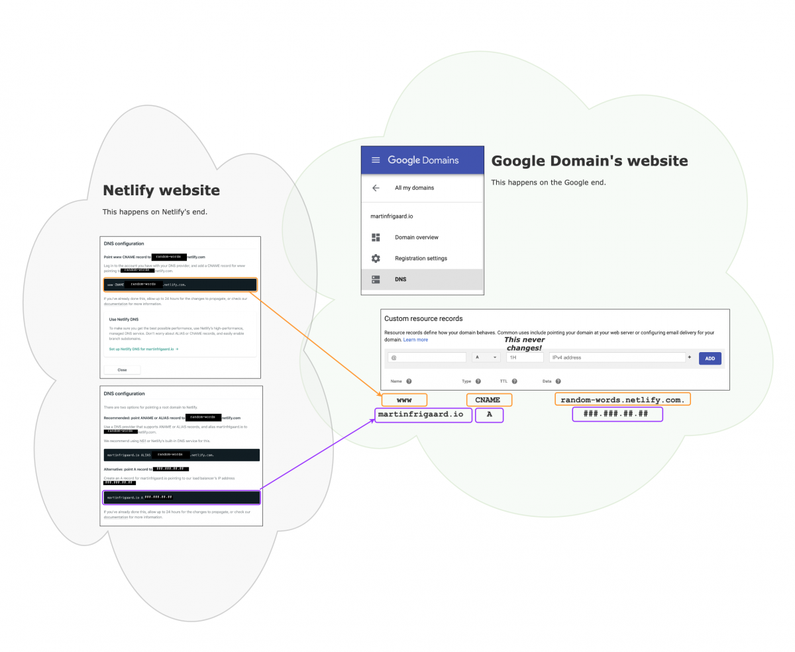
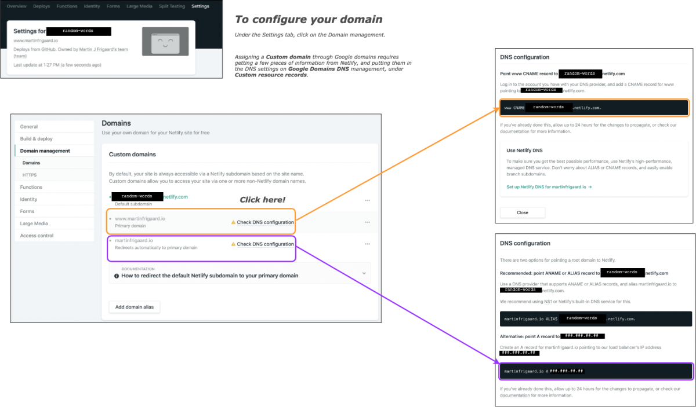

tidyverse tips
==============

This is a blog for various `tidyverse` tips from around the web. I try to update this blog everyday, but that's not always possible. 


## Blog structure and theme  

This blog was build using the `blogdown` package. The [hugo theme](https://themes.gohugo.io/devise) is devise by [austingebauer](https://github.com/austingebauer/devise). Here is an example site.


***

## Building sites with blogdown

If you want to know more about how to build sites with [blogdown](https://bookdown.org/yihui/blogdown/), check out [this post on Storybench](https://www.storybench.org/how-to-build-a-website-with-blogdown-in-r/). 

***

### Set up 

The initial setup was configured with Github using the following commands in 
the Terminal:

```bash
git remote add origin https://github.com/mjfrigaard/tidyverse-tips.git
git push -u origin master
```

### DNS configuration

DNS stands for [Domain Name Servers](https://en.wikipedia.org/wiki/Domain_Name_System). These help direct web traffic to your website, sort of like the phone book or yellow pages. 

We need to change the randomly generated domain name (https://random-words-blabla.netlify.com/) to the domain I’ve purchased (https://www.tidyverse.tips).

I can do this by following the instructions on the Netlify website. The image below shows the necessary parts from Netlify settings I needed to enter in the DNS settings on the Google Domains dashboard.

Anywhere it says `random-words`, you’ll enter the randomly generated domain from Netlify.

Anywhere it says `###.###.##.##`, you’ll enter the IP address for your domain.





